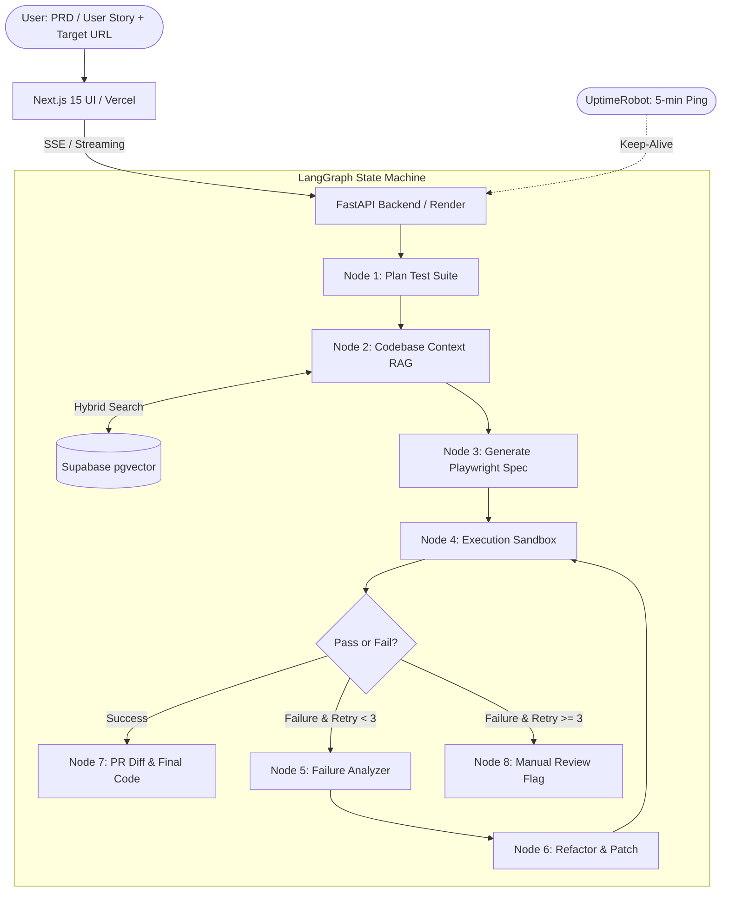

# Autonomous Spec-to-Playwright Engine with Self-Healing (LangGraph + RAG)

A production-grade, zero-cost AI Engineering portfolio project bridging Automation QA expertise with Agentic Workflows, Hybrid Retrieval-Augmented Generation (RAG), and Cloud Deployment.

---

## 1. System Architecture



---

## 2. 100% Free Production Stack

| Component | Technology | Free Tier Provision |
|---|---|---|
| **Frontend** | Next.js 15 (App Router), Tailwind CSS, shadcn/ui, Monaco Editor | Hosted on **Vercel** (Hobby plan) |
| **Backend & Orchestrator** | FastAPI, LangGraph, LangChain, Pydantic v2 | Hosted on **Render** (Free Web Service) |
| **Keep-Alive Worker** | UptimeRobot | Free 50 monitors, 5-minute HTTP pings to `/health` |
| **Database & Vector Store** | PostgreSQL + `pgvector` | Hosted on **Supabase** (500MB free database) |
| **Embeddings** | `fastembed` (`BAAI/bge-small-en-v1.5`) or `sentence-transformers` | Runs locally in memory on CPU ($0.00 cost) |
| **Primary LLMs** | Google AI Studio (Gemini 2.5 Flash / Flash-Lite) | Generous free API tier with 1M context |
| **Fallback LLMs** | OpenRouter (`:free` models: Llama 3.3 70B, Qwen 2.5 72B) | Rate-limited free community endpoints |
| **Observability & Tracing** | LangSmith | Free tier (5,000 traces/month) |

---

## 3. Monorepo Directory Structure

```text
spec-to-test-agent/
├── apps/
│   ├── backend/
│   │   ├── src/
│   │   │   ├── __init__.py
│   │   │   ├── main.py                     # FastAPI entrypoint & SSE streaming routes
│   │   │   ├── config.py                   # Environment variables & model routing
│   │   │   ├── db/
│   │   │   │   └── supabase_client.py      # Supabase connection & pgvector search
│   │   │   ├── graph/
│   │   │   │   ├── state.py                # TypedDict LangGraph state
│   │   │   │   ├── nodes.py                # Plan, RAG, Gen, Exec, Analyze, Patch
│   │   │   │   └── workflow.py             # Graph compilation & conditional edges
│   │   │   ├── rag/
│   │   │   │   ├── ingest.py               # Chunker & FastEmbed pipeline
│   │   │   │   └── retriever.py            # Hybrid search (vector + keyword)
│   │   │   └── sandbox/
│   │   │       └── runner.py               # Playwright headless CLI execution runner
│   │   ├── requirements.txt
│   │   ├── Dockerfile
│   │   └── .env.example
│   └── frontend/
│       ├── src/
│       │   ├── app/
│       │   │   ├── page.tsx                # Main dashboard with live streaming
│       │   │   ├── layout.tsx
│       │   │   └── api/                    # Proxy endpoints (if needed)
│       │   ├── components/
│       │   │   ├── GraphTimeline.tsx       # Visual state transition viewer
│       │   │   ├── CodeViewer.tsx          # Monaco diff viewer for test code
│       │   │   ├── SpecForm.tsx            # Input requirements & target URL
│       │   │   └── FailureTelemetry.tsx    # Stack trace & error breakdown
│       │   └── lib/
│       ├── package.json
│       └── tailwind.config.ts
├── packages/
│   └── test-fixtures/                      # Reference Page Objects & baseline Playwright tests
├── .gitignore
├── README.md
└── docker-compose.yml
```

---

## 4. Phase-by-Phase Implementation Roadmap

### Phase 1: Environment, Database & Vector RAG (Week 1)
- [ ] Initialize Git monorepo with `apps/backend` and `apps/frontend`.
- [ ] Set up free accounts: Supabase, Google AI Studio, OpenRouter, and LangSmith.
- [ ] In Supabase SQL console, run:
  ```sql
  create extension if not exists vector;

  create table if not exists test_knowledge_base (
      id bigserial primary key,
      file_path text,
      chunk_type text, -- 'page_object', 'utility', 'spec_pattern'
      content text,
      metadata jsonb,
      embedding vector(384)
  );

  create index on test_knowledge_base using hnsw (embedding vector_cosine_ops);
  ```
- [ ] Implement `apps/backend/src/rag/ingest.py` using `fastembed` to parse and embed reference Playwright tests and page object models into Supabase.

### Phase 2: LangGraph State Machine & Playwright Execution Sandbox (Week 2)
- [ ] Define the central `AgentState` schema using `TypedDict` and `pydantic`.
- [ ] Build the **Sandbox Runner** (`apps/backend/src/sandbox/runner.py`):
  - Spawns an isolated subprocess running `npx playwright test temp_spec.ts --reporter=json`.
  - Captures `stdout`, `stderr`, locator timeouts, and exit code.
- [ ] Wire the circular graph in `apps/backend/src/graph/workflow.py`:
  - `Plan` $\to$ `Retrieve Context` $\to$ `Generate Test` $\to$ `Execute Test`
  - `Conditional Edge`: If tests pass $\to$ `END`. If fail and `retries < 3` $\to$ `Analyze & Patch` $\to$ loop to `Execute`.

### Phase 3: Real-Time SSE Streaming & Modern Next.js UI (Week 3)
- [ ] Expose a FastAPI route `/api/run-agent` that streams graph events using `StreamingResponse(event_generator(), media_type="text/event-stream")`.
- [ ] Build the Next.js frontend with:
  - Spec requirement input form and base URL selector.
  - Live progress stepper highlighting which LangGraph node is currently executing.
  - Interactive code pane displaying the generated test and diff updates as self-healing patches occur.

### Phase 4: Production Deployment & Zero-Downtime Keep-Alive (Week 4)
- [ ] Deploy backend to **Render Web Service** via Docker:
  - Expose `/health` route returning `{"status": "alive"}`.
- [ ] Set up **UptimeRobot**:
  - Configure an HTTP monitor targeting `https://<render-slug>.onrender.com/health` every 5 minutes to prevent the service from sleeping.
- [ ] Deploy frontend to **Vercel** and wire environment variable `NEXT_PUBLIC_API_URL`.
- [ ] Enable CORS on FastAPI for the Vercel production domain.

---

## 5. Success Metrics for Your Portfolio
1. **Self-Healing Success Rate:** Demonstrates that $\ge 70\%$ of broken locators/assertions are fixed autonomously without human intervention.
2. **Cost per Spec Generation:** Documented as **$0.00** using Google AI Studio free tier / OpenRouter community models.
3. **Execution Latency:** Average full end-to-end cycle under 45 seconds.